# MMF Portal Entity Relationship Diagram

```mermaid
erDiagram
    BUSINESS_UNITS ||--o{ COUNTRIES : contains
    BUSINESS_UNITS ||--o{ ACCOUNTS : owns
    BUSINESS_UNITS ||--o{ PROSPECT_UPLOAD_BATCHES : receives
    BUSINESS_UNITS ||--o{ PROSPECTS : scopes
    BUSINESS_UNITS ||--o{ OPPORTUNITIES : scopes
    BUSINESS_UNITS ||--o{ RADAR_ENGINES : configures
    BUSINESS_UNITS ||--o{ CAMPAIGNS : runs
    BUSINESS_UNITS ||--o{ RADAR_SIGNALS : receives
    BUSINESS_UNITS ||--o{ KPI_SNAPSHOTS : measures

    COUNTRIES ||--o{ ACCOUNTS : locates
    COUNTRIES ||--o{ PROSPECTS : locates
    COUNTRIES ||--o{ OPPORTUNITIES : locates
    COUNTRIES ||--o{ CAMPAIGNS : scopes
    COUNTRIES ||--o{ RADAR_SIGNALS : locates
    COUNTRIES ||--o{ KPI_SNAPSHOTS : measures

    PORTAL_VIEWS ||--o{ ROLES : defaults
    ROLES ||--o{ ROLE_PERMISSIONS : grants
    MODULES ||--o{ ROLE_PERMISSIONS : controls

    ACCOUNTS ||--o{ PROSPECTS : identifies
    ACCOUNTS ||--o{ OPPORTUNITIES : has
    ACCOUNTS ||--o{ RADAR_SIGNALS : triggers

    PROSPECT_UPLOAD_BATCHES ||--o{ PROSPECT_UPLOAD_RECORDS : contains
    PROSPECT_UPLOAD_BATCHES ||--o{ PROSPECTS : imports
    PROSPECTS ||--o{ PROSPECT_INTERACTIONS : records
    PROSPECTS ||--o| OPPORTUNITIES : converts_to

    SOLUTIONS ||--o{ ASSETS : contains
    SOLUTIONS ||--o{ PLAY_TEMPLATES : supports
    SOLUTIONS ||--o{ CAMPAIGNS : promotes
    SOLUTIONS ||--o{ OPPORTUNITIES : proposed_for

    RADAR_ENGINES ||--o{ CAMPAIGNS : drives
    RADAR_ENGINES ||--o{ RADAR_SIGNALS : produces

    CAMPAIGNS ||--o{ UPLOADED_TARGET_ACCOUNTS : targets
    CAMPAIGNS ||--o{ CAMPAIGN_HISTORY : changes

    SMART_AGENTS ||--o{ AGENT_USAGE_METRICS : measures
    GOVERNANCE_COUNCILS ||--o{ GOVERNANCE_MEETINGS : holds

    BUSINESS_UNITS {
        text code PK
        text name UK
        boolean has_countries
    }
    COUNTRIES {
        text name PK
        text business_unit_code FK
    }
    PORTAL_VIEWS {
        text name PK
        jsonb navigation
    }
    ROLES {
        text name PK
        text portal_view_name FK
    }
    MODULES {
        text name PK
    }
    ROLE_PERMISSIONS {
        text role_name PK,FK
        text module_name PK,FK
        text access_level
    }
    ACCOUNTS {
        text name PK
        text business_unit_code FK
        text country_name FK
        text sector
        smallint tier
    }
    PROSPECT_UPLOAD_BATCHES {
        text id PK
        text business_unit_code FK
        text file_name
        timestamptz uploaded_at
    }
    PROSPECT_UPLOAD_RECORDS {
        text batch_id PK,FK
        integer row_number PK
        text result
    }
    PROSPECTS {
        text id PK
        text account_name FK
        text business_unit_code FK
        text country_name FK
        text upload_batch_id FK
        text lifecycle_stage
    }
    PROSPECT_INTERACTIONS {
        bigint id PK
        text prospect_id FK
        text interaction_type
        date interaction_date
    }
    OPPORTUNITIES {
        text id PK
        text account_name FK
        text business_unit_code FK
        text country_name FK
        text solution_name FK
        text prospect_id FK,UK
    }
    SOLUTIONS {
        text name PK
        text solution_class
        text maturity
        text certification_status
    }
    ASSETS {
        bigint id PK
        text solution_name FK
        text name
        text version
    }
    PLAY_TEMPLATES {
        text name PK
        text solution_name FK
        text channel
    }
    RADAR_ENGINES {
        text name PK
        text business_unit_code FK
        text schedule
    }
    CAMPAIGNS {
        text name PK
        text business_unit_code FK
        text country_name FK
        text solution_name FK
        text radar_engine_name FK
        text status
    }
    CAMPAIGN_PLAYBOOK_PARTS {
        text name PK
        smallint display_order UK
    }
    UPLOADED_TARGET_ACCOUNTS {
        bigint id PK
        text campaign_name FK
        text business_unit_code FK
        text country_name FK
    }
    CAMPAIGN_HISTORY {
        bigint id PK
        text campaign_name FK
        timestamptz changed_at
    }
    RADAR_SIGNALS {
        bigint id PK
        text account_name FK
        text radar_engine_name FK
        text business_unit_code FK
        text country_name FK
    }
    DATA_SOURCE_CONNECTORS {
        text name PK
        text connector_type
        boolean is_active
    }
    SMART_AGENTS {
        text name PK
        text lifecycle_stage
        text status
        text version
    }
    AGENT_USAGE_METRICS {
        bigint id PK
        text agent_name FK
        timestamptz measured_at
        integer invocation_count
    }
    GOVERNANCE_COUNCILS {
        text name PK
        text scope
        date next_meeting_date
    }
    GOVERNANCE_MEETINGS {
        bigint id PK
        text council_name FK
        date meeting_date
    }
    GOVERNANCE_DECISIONS {
        bigint id PK
        date decision_date
        text status
    }
    GOVERNANCE_ACTIONS {
        bigint id PK
        date due_date
        text status
    }
    RACI_ASSIGNMENTS {
        text activity PK
        text responsible
        text accountable
    }
    MVP_OUTCOMES {
        bigint id PK
        text outcome UK
        text status
    }
    REFERENCE_DATA {
        text category PK
        text governance_status
    }
    KPI_DEFINITIONS {
        text name PK
        text unit
    }
    KPI_SNAPSHOTS {
        bigint id PK
        text business_unit_code FK
        text country_name FK
        timestamptz as_of
    }
    AUDIT_EVENTS {
        bigint id PK
        timestamptz occurred_at
        text actor_name
        text action
    }
```

`GOVERNANCE_DECISIONS`, `GOVERNANCE_ACTIONS`, `RACI_ASSIGNMENTS`, `MVP_OUTCOMES`, `REFERENCE_DATA`, `KPI_DEFINITIONS`, `AUDIT_EVENTS`, `CAMPAIGN_PLAYBOOK_PARTS`, and `DATA_SOURCE_CONNECTORS` are standalone because the prototype stores their references and owners as descriptive text rather than stable entity IDs.
