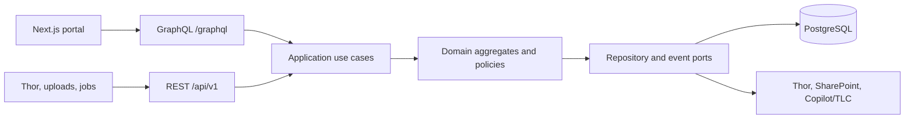

# MMF Portal Domain Architecture

## Architectural style

Implement the backend as a Spring Boot 4 modular monolith. Each bounded context owns its domain model, application use cases, persistence adapters and API adapters. REST controllers and GraphQL resolvers are peer inbound adapters: neither calls the other, and neither contains business rules.



Use one deployable initially. Split a context into a service only when its scaling, ownership or release cadence requires it; the package boundaries and ports below preserve that option.

## Bounded contexts

| Context | Aggregate roots | Responsibilities |
| --- | --- | --- |
| Identity & Access | Role, PortalView | Authentication, permissions and country/BU scope |
| Pipeline | Account, Prospect, Opportunity, UploadBatch | Prospect intake, interaction history and one-way conversion to a Thor opportunity |
| Go-to-Market | Campaign, PartnerPlay | Campaign lifecycle, target accounts and partner-play links |
| Solution Catalog | Solution, Asset | Reusable assets, certification, versions and refresh lifecycle |
| Opportunity Sensing | RadarEngine, RadarSignal | Source configuration, collection runs, scoring and signal review |
| Agent Catalog | Agent | External agent registration, recommendation metadata and launch tracking |
| Governance | Council, Decision, Action | Decisions, actions, RACI and audit history |
| Analytics | KpiSnapshot | Read-only projections assembled from domain events and Thor extracts |

Cross-context references use stable IDs or names at the boundary. A context must not load and mutate another context's persistence entity.

## API responsibilities

### REST

Use REST for resource lifecycle operations, integrations, file transfer and asynchronous commands:

- Excel prospect batches and asset file uploads
- Thor/Salesforce ingestion and webhook-style integrations
- Radar run submission (`202 Accepted`)
- CRUD needed by administration clients
- Health, operations and generated client SDKs

The contract is [openapi/mmf-portal-api.yaml](../openapi/mmf-portal-api.yaml). Request schemas are commands, not serialized database entities. Derived values such as campaign metrics, reuse counts, launch counts and radar counters are output-only.

### GraphQL

Use GraphQL for portal screens that compose several contexts:

- Dashboard and scoped KPI views
- Pipeline detail with interactions and converted opportunity
- Campaign detail with metrics, solution and partner plays
- Radar signal detail with recommended agents
- Solution/asset maintenance views

The contract is [graphql/schema.graphqls](../graphql/schema.graphqls). Binary upload remains REST because multipart upload is not part of the GraphQL specification. After upload, the resulting asset is available through both APIs.

### Shared application layer

A REST controller and GraphQL mutation for the same action call the same command handler. For example:

```text
PUT /api/v1/prospects/{id}                 updateProspect(id, input)
POST /api/v1/prospects/{id}/convert        convertProspect(id, input)
PATCH /api/v1/assets/{id}/lifecycle         transitionAsset(id, input)
POST /api/v1/radar/engines/{name}/runs     runRadarEngine(name)
POST /api/v1/agents/{name}/launches        launchAgent(name, context)
```

This prevents business rules from drifting between protocols.

## Spring package layout

Use package-by-context, then hexagonal layers inside each context:

```text
com.capgemini.mmf
  pipeline
    domain          Aggregate roots, value objects, policies, domain events
    application     Commands, queries, handlers, transaction boundaries
    adapter.in.rest REST controllers and DTO mapping
    adapter.in.gql  GraphQL query/mutation resolvers and batching loaders
    adapter.out.db  JPA records, repositories and domain mapping
    adapter.out.thor
  campaign
  catalog
  radar
  agentcatalog
  governance
  analytics
  identity
  shared            IDs, money, clock, event envelope; no domain entities
```

Do not create shared repositories or a generic base aggregate. Share only stable technical primitives.

## Aggregate invariants

- **Prospect:** ID, account, country/BU and source are immutable. A converted prospect is read-only. Conversion creates exactly one opportunity and records an audit event in one transaction.
- **Campaign:** status changes follow the configured lifecycle. Metrics are projections from interactions, target accounts and linked opportunities and cannot be edited directly.
- **Asset:** lifecycle transitions are validated by the aggregate. Certification and re-certification require an owner, version and next review date. Retirement preserves historical links.
- **RadarEngine:** at least one source is enabled, score is 0-100 and only one run may be active per engine. A run is asynchronous.
- **RadarSignal:** status transitions are `New -> Reviewed|Dismissed`; score inputs are immutable evidence for the calculated score.
- **Agent:** published agents require a valid platform and launch URL. Launches append usage events; counters are projections.
- **PartnerPlay:** linking is many-to-many and requires campaign geography to intersect eligible country codes.

## Transactions and events

Keep each aggregate mutation in one local database transaction. Write an outbox event in that transaction for cross-context effects. Suggested events:

- `ProspectInteractionLogged`
- `ProspectQualified`
- `ProspectConverted`
- `CampaignStatusChanged`
- `PartnerPlayLinked`
- `AssetLifecycleChanged`
- `RadarSignalDetected`
- `RadarSignalReviewed`
- `AgentLaunched`

Projection handlers update dashboard KPIs and derived campaign metrics asynchronously. Consumers must be idempotent by event ID. Thor and Salesforce belong behind an anti-corruption layer so their field names and stage model do not leak into the Pipeline domain.

## Security and performance

Resolve the authenticated user's scope once per request and pass it to application queries. Enforce country/BU scope in repository predicates, not only in controllers or resolvers. Use GraphQL DataLoader for nested relationships and cap page size at 200, matching REST. Never expose connector credentials, SharePoint tokens or agent access tokens in either API.

## Delivery sequence

1. Implement Identity & Access plus the Pipeline aggregate and its REST/GraphQL adapters.
2. Add Campaign and Solution Catalog, including derived metric projections and asset lifecycle.
3. Add Radar and Agent Catalog with asynchronous runs and launch events.
4. Add Governance and Analytics projections.
5. Introduce external messaging only when asynchronous processing moves out of process; start with a PostgreSQL outbox worker.
